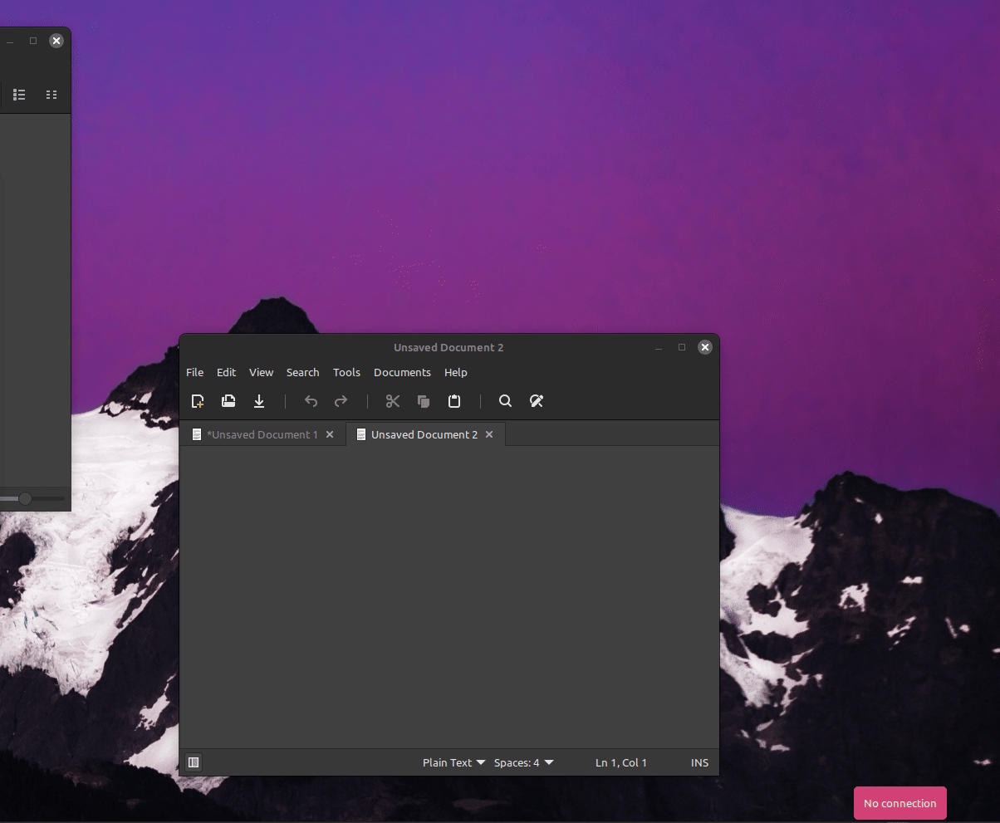

# stt-hotkey-linux
 *Turn your voice into text anywhere on Linux you can paste your clipboard, **no cloud required.**

## Demo



---

Local-first speech-to-text toolkit for Linux (Cinnamon/Mint) using `whisper.cpp`. Hotkey-driven recording, clipboard copy, model switching (fast/better/multilingual), and a simple installer.

Local speech-to-text hotkey toolkit for Linux Mint / Cinnamon using `whisper.cpp`.

## What it does

- 🎤 Press a hotkey → speak → Press again to stop and transcribe → text appears in your clipboard
- 🔒 Fully local (no cloud, no API keys)
- Reset stuck state
- View logs
- Re-copy last to clipboard
- **Advanced** Multiple Whisper models (fast vs accurate - this utility uses minimum viable langauge model sizes)
- **Advanced** Model comparison tool (`stt-compare`)
- **Advanced** Switch between fast English, better English, and multilingual modes

## Requirements

- Linux (tested and built with Mint/Cinnamon)
- X11 clipboard support

## Packages

```bash
sudo apt update
sudo apt install git cmake build-essential ccache ffmpeg sox xclip alsa-utils libnotify-bin
```

---

## 🚀 Quick Install

Clone the repo and run the installer:

```bash
cd ~
git clone https://github.com/Mousie-mouse/stt-hotkey-linux.git
cd ~/stt-hotkey-linux
./install/install.sh
```
### What the installer does

The installer automatically:

- Installs all stt-* scripts to ~/.local/bin
- Clones and builds whisper.cpp (if missing)
- Downloads the base.en model
- Creates runtime directories:
	- ~/stt-audio-tests/audio
	- ~/stt-audio-tests/transcripts
- Verifies installation

No manual whisper setup required.

**Advanced** commands will prompt you to intstall the needed models on the command's first use, then install

## First Run

Test the tool:

```bash
stt
sleep 5
stt
```

Your transcript will be copied to the clipboard.

---

## Troubleshooting Audio (Important)

If transcription returns empty:

1. Check devices
```bash
arecord -l
```
2. List usable inputs
```bash
arecord -L | sed -n '1,120p'
```
3. Test microphone manually
```bash
arecord -D plughw:CARD=PCH,DEV=0 -f S16_LE -c 2 -r 16000 -d 5 /tmp/test.wav
aplay /tmp/test.wav
```
4. Adjust input levels
```bash
alsamixer
```
Common issue:

- Hardware often requires stereo (2 channels)
- plughw: is required for resampling
- ALSA doesn't play with all microphone configurations
- Some systems are displaying no notifcations despite functioning normally otherwise

If `stt` is not found immediately after install, open a new terminal or use:

```bash
~/.local/bin/stt
```
## Suggested shortcuts

Hotkeys (Cinnamon)
Gestures (Cinnamon)


Bind these in System Settings → Keyboard → Shortcuts:
- `Super+Z` → `stt`
- `Super+Shift+Z` → `stt-reset`
- `Ctrl+Shift+L` → `stt-log`
- `Super+Shift+V` → `stt-last`
- **Advanced** `Super+Alt+1` → `stt-mode-fast-en`
- **Advanced** `Super+Alt+2` → `stt-mode-better-en`
- **Advanced** `Super+Alt+3` → `stt-mode-multi-auto`
- **Advanced** `Super+Alt+0` → `stt-mode-status`
- **Advanced** `Super+Alt+c`→ `stt-compare`

---

## Models (**Advanced** Optional)

By default, the installer downloads only:

- `base.en` → fast, lightweight, English-only

This keeps install size small and fast.

### Install additional models

If you want higher accuracy or multilingual support:

- Better English accuracy
```bash 
./models/download-ggml-model.sh small.en
```
- Multilingual model (auto language detection)
```bash 
./models/download-ggml-model.sh small
```

If you want to add larger models, they are available, but I did not share them because the utility is more helpful to me when it is fast.  

## When to use what

- Use `base.en` → quick notes, commands, low CPU
- Use `small.en` → better transcription quality
- Use `small` → mixed languages / unknown language

## Switching modes
- `base.en` 
```bash
stt-mode-fast-en
```
- `small.en`
 ```bash
 stt-model-better-en
```
- `small` (I recommend a larger whisper model if you are consistently using multiple langauges during conversations)
```bash
stt-model-multi-auto
```
- Check current STT model
```bash
stt-status
```

---

## Model Comparison Tool (`stt-compare`)

This project includes a utility for comparing Whisper models on the same audio input.

What it does
- runs base.en and small.en
- saves transcropts
- shows differences
- copies best result to clipboard

### Usage

Run on the default test file or most recent transcription:

```bash
stt-compare
```

Run on a specific audio file: 

```bash 
stt-compare ~/stt-audio-tests/audio/base-test.wav
 ```

What it does

- Runs ` base.en ` (fast & light)
- Runs ` small.en` (more accurate if installed)
- Saves Transcripts to: ` ~/stt-audio-tests/transcripts/ `
- Displays both outputs w side-to-side comparison
- Copies result to the clipboard

---

## 🧠 Why this exists

Most speech-to-text tools:

- require cloud APIs
- collect data
- introduce latency

This tool is:

- offline
- fast
- fully under your control

---

## ⚠️  Notes

- Requires working microphone input (ALSA)
- Uses whisper.cpp models locally
- First install will take a few minutes (build + model download)

Security / Privacy

- Runs fully locally (no external API calls)
- Audio never leaves the machine
- No persistent storage of recordings
- Minimal dependencies

---

### 🤝 Contributing

Issues and PRs welcome. *add socials and walets*

---

### 📜 License

MIT
